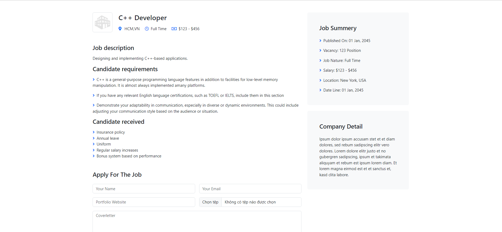
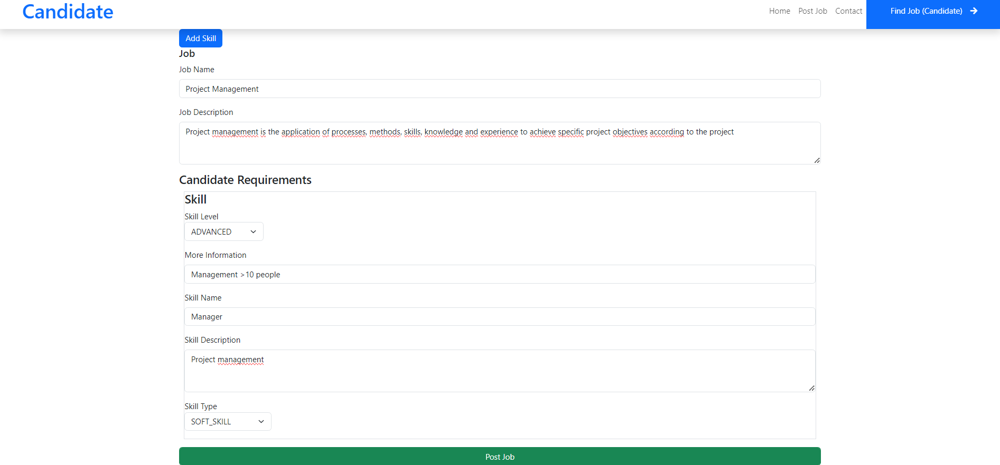

## Giới thiệu:
- Môn học: Lập trình WWW (Java)
- Chủ đề: Bài tập tuần 05
   

## Đề bài:

 

## Bài làm:
<b>1.Ứng viên đăng nhập</b>
- Khi ứng viên mới đăng nhập hệ thống sẽ tự động đề cử cho ứng viên 1 danh sách các job phù hợp với các skill mà ứng viên hiện có
  
- Nếu muốn tìm kiếm có thể tìm kiếm theo công ty,công việc hay skill mong muốn ở thanh search
  
- Khi ứng viên click vào 1 job sẽ hiện ra thông tin chi tiết của job đó
  
- Ứng viên có thể xem gợi ý 1 số skill mới mà mình chưa có để học
  
   
  <b>2.Công ty đăng nhập tìm kiếm ứng viên</b>
- Công ty đăng bài tuyển nhân viên
  
- Có thể thêm nhiều skill mong muốn bằng nút Add Skill
  
- Tìm kiếm ứng viên phù hợp với công việc
  
- Bấm nút mới để gửi email mời ứng viên đó tham gia công ty.Sau khi mời ứng viên sẽ nhận được email sau
  
